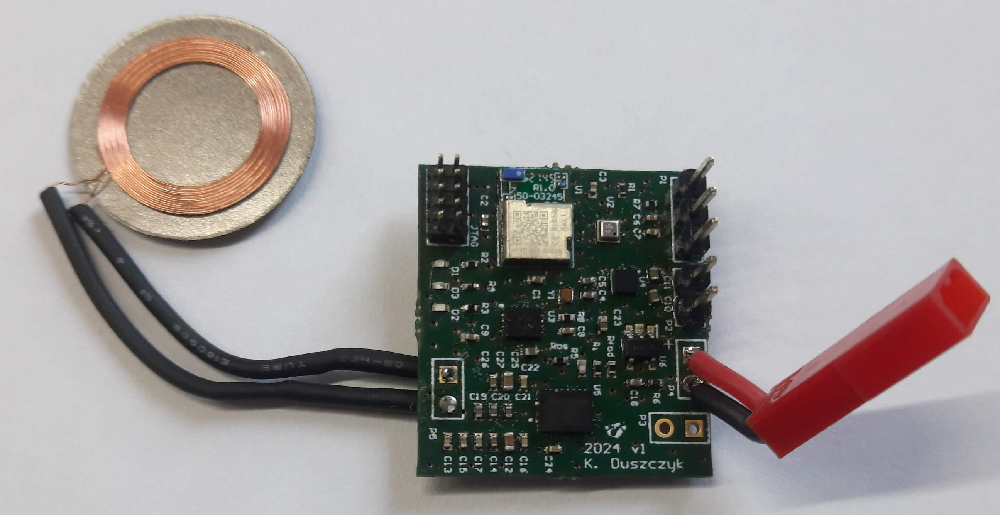
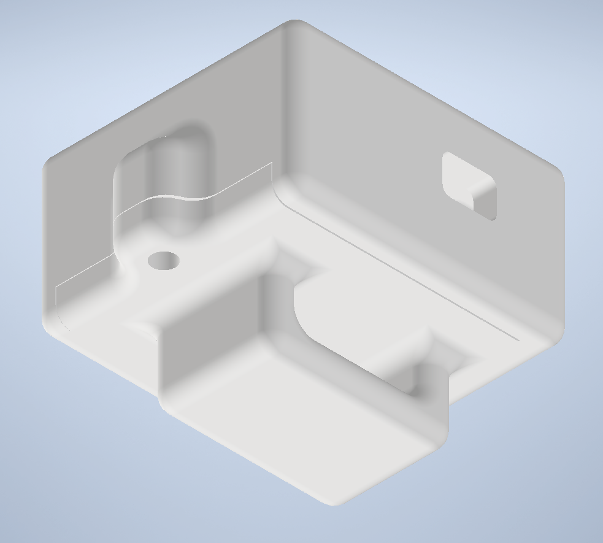
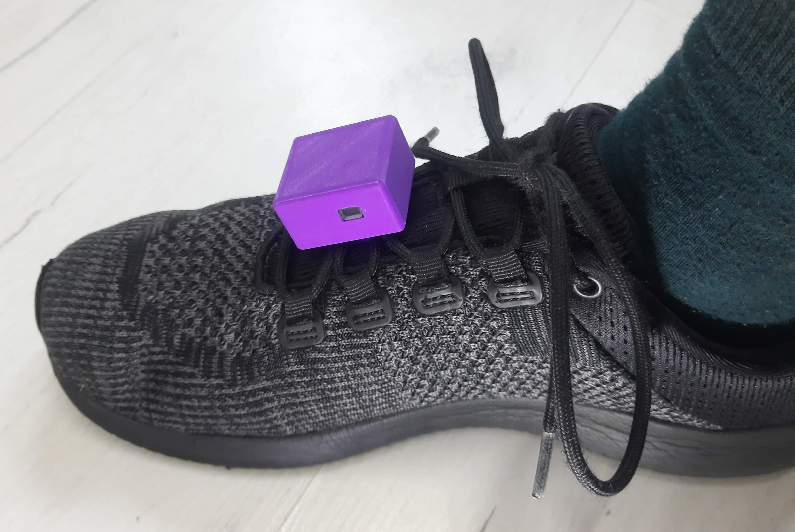

# Gait Monitoring - IoT Bachelor of Engineering Thesis

## Abstract

This thesis describes the design and development of a wearable device for monitoring changes in human gait parameters. The device utilizes **BMI270** and **BMP390** sensors from Bosch Sensortec and the **nRF52833** chip from Nordic Semiconductors, operating under the control of the **Zephyr real-time operating system**. Collected measurement data is transmitted to the user's smartphone via **Bluetooth Low Energy** wireless interface. The device features wireless charging compliant with the **Qi standard**.

The work presents the PCB design and assembly process, implementation of a multi-threaded software architecture in the Zephyr RTOS, as well as conducted tests that demonstrated the device operates according to design specifications.

## Project Structure

This repository contains the code and documentation for the thesis project. Project consists of three main components:
1. PCB Design
2. Firmware Development
3. 3D Printed Enclosure

### PCB Design

The PCB design files are located in the `pcb/` directory. The design was created using Altium Designer. The PCB includes the following key components:
- BL653u module with nRF52833 SoC (BLE)
- BMI270 IMU sensor
- BMP390 Barometric sensor
- BQ51013B Qi Wireless Charging Receiver
- MCP73831 Battery Charger
- LDO LP5912-3.3DRVR

PCB was assembled using standard SMD soldering techniques. Photo of the assembled PCB:

### 3D Printed Enclosure

The 3D printed enclosure was designed in Autodesk Inventor. The enclosure is designed to be mounted on a shoe and is resistant to weather conditions.

The 3D model files are located in the `enclosure/` directory. The enclosure was printed using PLA material.

### Firmware Development

The firmware was developed using the Zephyr RTOS. The source code is located in the `firmware/` directory. The firmware implements the following features:
- Multi-threaded architecture for handling sensor data and BLE communication
- Sensor data acquisition from BMI270 and BMP390
- Secure and efficient data transmission via Bluetooth Low Energy (using NUS service and bonding with PIN code)
- Custom Devicetree for energy-efficient operation
